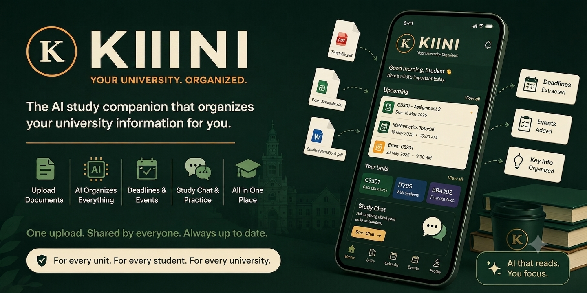

# Kiini — One School, One Brain, Every Student

Kiini turns a university's PDFs, timetables and group chats into one shared, structured student workspace — no accounts, no passwords, just your name and your units.



## Tech Stack

| Layer | Choice |
|---|---|
| Framework | Expo (React Native) SDK 57 |
| Navigation | `expo-router` (file-based routing) |
| Auth + DB + Storage + Realtime | Supabase |
| AI | Gemma 4 API |
| Client state | Zustand |
| UI components | `@gorhom/bottom-sheet`, `react-native-reanimated` |
| File picking | `expo-document-picker`, `expo-image-picker` |

## Quick Start

```bash
npm install
npx expo start
```

Then scan the QR code with **Expo Go** (iOS/Android) or press `w` for web.

### Web

```bash
npx expo start --web
```

## Project Structure

```
kiini/
├── app/                           # expo-router file-based routing
│   ├── _layout.tsx                # Root layout (auth gate, safe area, toast)
│   ├── index.tsx                  # Entry — redirects to onboarding or home
│   ├── onboarding/                # 4-step onboarding flow
│   │   └── welcome/profile/units/room.tsx
│   ├── (tabs)/                    # Bottom tab navigator
│   │   └── home/units/rooms/events/hub.tsx
│   ├── unit/[id].tsx              # Unit workspace (files, upload, topics)
│   ├── room/[id].tsx              # Room detail (chat, files, members)
│   └── admin/                     # Admin console
│       └── sign-in.tsx / console.tsx
├── src/
│   ├── components/                # Shared UI components
│   │   ├── SafeScreen.tsx         # Safe area wrapper
│   │   ├── TopBar.tsx             # Navigation header with breadcrumbs
│   │   ├── Toast.tsx              # Toast notification provider
│   │   └── Stamp.tsx              # Rubber-stamp badge
│   ├── lib/
│   │   ├── supabase.ts            # Supabase client
│   │   ├── gemma.ts               # Gemma 4 API client (stubs)
│   │   ├── store.ts               # Zustand stores
│   │   └── mock-data.ts           # Demo data (runs without Supabase)
│   ├── hooks/                     # Custom hooks
│   │   └── useAuth.ts
│   ├── types/                     # TypeScript interfaces
│   ├── constants/                 # Theme tokens, course catalog
│   └── utils/                     # Helpers (initials, file size, etc.)
├── supabase/
│   └── schema.sql                 # Full DB schema + RLS + RPCs + seed data
├── design/                        # Static HTML/CSS reference files
├── impl-plan.md                   # Architecture and implementation plan
└── writeup.md                     # Hackathon writeup
```

## Features

- **Anonymous auth** — no passwords, instant onboarding
- **Unit workspaces** — per-unit file browser with topic folders
- **Smart upload** — Gemma 4 classifies, renames, and files PDFs/images
- **Room chat** — per-unit group chat with @Gemma AI answers
- **Shared files** — personal vs. room file spaces with share/save
- **Timetable** — weekly class schedule extracted from PDFs
- **Events** — course-filtered campus events feed
- **Info Hub** — Q&A grounded in university documents
- **Admin console** — magic-link auth for officials to post events and manage documents

## Mock Mode

The app runs fully with mock data — no Supabase or Gemma credentials needed. Create a `.env` file to connect real services:

```env
EXPO_PUBLIC_SUPABASE_URL=https://your-project.supabase.co
EXPO_PUBLIC_SUPABASE_ANON_KEY=your-anon-key
EXPO_PUBLIC_GEMMA_API_KEY=your-gemma-api-key
```

## Database

The full Supabase schema is in `supabase/schema.sql` — includes:
- 12 tables with RLS policies
- 3 SECURITY DEFINER RPC functions (`is_room_member`, `join_room_by_code`, `create_room`)
- Storage RLS policies
- Indexes
- Seed data for courses and units

## Build

```bash
# Web export
npx expo export --platform web

# Android APK (requires EAS or Android Studio)
eas build -p android --profile preview

# iOS (requires EAS or Xcode)
eas build -p ios --profile preview
```

## License

Apache 2.0
